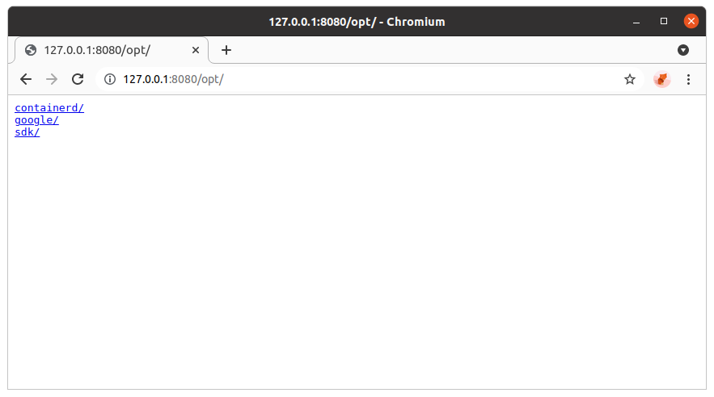

# GoShare

GoShare provides a simple Web UI and a file transfer service which using HTTP or FTP protocol.

## Install

### Download executable

Download the compiled **[release](https://github.com/duruyao/goshare/releases)** for your platform.

### Compile from source

**Prerequisites**: [Golang (version >= 1.17)](https://golang.org/)

```bash
git clone https://github.com/duruyao/goshare.git goshare && \
  pushd goshare && \
  chmod +x build.sh && \
  ./build.sh && \
  popd
```

## Usage

The following operation takes the Linux platform as an example.

Add executable permissions to the current file.

```bash
chmod +x goshare
```

Type `./goshare -h` to show usage.

```text
Usage: goshare [OPTIONS]

GoShare shares file and directory by HTTP or FTP protocol

Options:
    -h, --help                  Display this help message
    --host STRING               Host address to listen (default: 'localhost:3927')
    --path STRING               Path or directory (default: '/home/duruyao/project/goshare')
    --scheme STRING             Scheme name (default: 'http')
    --url-prefix STRING         Custom URL prefix (default: '/')
    -v, --version               Print version information and quit

Examples:
    goshare -host example.io -path /opt/share0/releases/
    goshare -host localhost:3927 -path /opt/share0/releases/
    goshare --host localhost:3927 --url-prefix /releases/ --path /opt/share0/releases/
    goshare --host=localhost:3927 --url-prefix=/releases/ --path=/opt/share0/releases/

See more about GoShare at https://github.com/duruyao/goshare
```

Start GoShare.

```bash
sudo ./goshare --host 127.0.0.1:8080 --path /opt/ --url-prefix /opt/
```

Press `Ctrl_Z` to stop the service in foreground.

Type `jobs` to show all the jobs' status contains of **JOB_ID**.

Use the `fg` to start and run the service in background.

```bash
fg %JOB_ID
```

Access [http://127.0.0.1:8080/opt/](http://127.0.0.1:8080/opt/) in your browser.



Share the files with your group members by using the **LAN IP** or **WAN IP** instead of `localhost`, `127.0.0.1` or `*`. 

Download a file by `wget`.

```bash
wget [-P <Destination Directory>] [-O <Destination Path>] <https://ip:port/path/to/file>
```

Download a file by `curl`.

```bash
curl --request GET -sL --url <https://ip:port/path/to/file> --output </path/to/file>
```

Download a directory by `wget`.

```bash
wget [-P <Destination Directory>] -r -np -nH -R 'index.html*' <https://ip:port/path/to/dir/>
```
