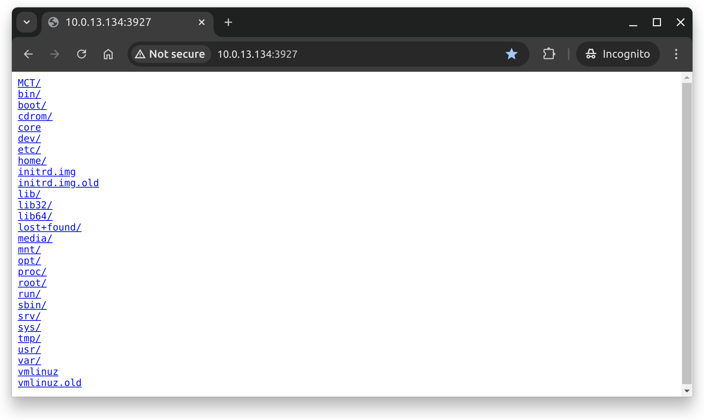

# GoShare

GoShare provides a simple Web UI and a file transfer service which using HTTP protocol.

## Install

### Download executable

Download the compiled **[releases](https://github.com/duruyao/goshare/releases)** for your platform.

## Usage

Type `goshare -h` to show help manual.

```text

   _____       _____ _
  / ____|     / ____| |
 | |  __  ___| (___ | |__   __ _ _ __ ___
 | | |_ |/ _ \\___ \| '_ \ / _' | '__/ _ \
 | |__| | (_) |___) | | | | (_| | | |  __/
  \_____|\___/_____/|_| |_|\__,_|_|  \___|


Usage: goshare [OPTIONS]

GoShare shares files and directories via HTTP protocol

Options:
    -h, --help                  Display this help message
    --host STRING               Host address to listen (default: '0.0.0.0:80')
    --path STRING               Path or directory (default: '${PWD}')
    --scheme STRING             Scheme name (default: 'http')
    --url-prefix STRING         Custom URL prefix (default: '/')
    -v, --version               Print version information and quit

Examples:
    ./goshare -host 0.0.0.0:80 -path ${PWD}
    ./goshare --host 0.0.0.0:80 --path ${PWD} --url-prefix /
    ./goshare --host=0.0.0.0:80 --path=${PWD} --url-prefix=/

See more about GoShare at https://github.com/duruyao/goshare

```

Start goshare in the foreground.

```bash
sudo goshare --host=localhost:3927 --url-prefix=$PWD --path=$PWD
```

Start goshare in the background.

```bash
sudo goshare --host=localhost:3927 --url-prefix=$PWD --path=$PWD &
```

Start goshare in the background via **Nohup**.

```bash
sudo nohup goshare --host=localhost:3927 --url-prefix=$PWD --path=$PWD </dev/null 1>/tmp/goshare.out 2>&1 &
```

Share the files with your group members by using the **LAN IP** or **WAN IP** instead of `localhost`, `127.0.0.1`, `*` or `0.0.0.0`.

Browse the file system via a web browser.



Download files via `wget` or `curl`.

```bash
wget <https://ip:port/path/to/file>

curl <https://ip:port/path/to/file> -o <file>
```

Download the directories via `wget`.

```bash
wget -r -np -nH -R "index.html*" <https://ip:port/path/to/dir>
```
